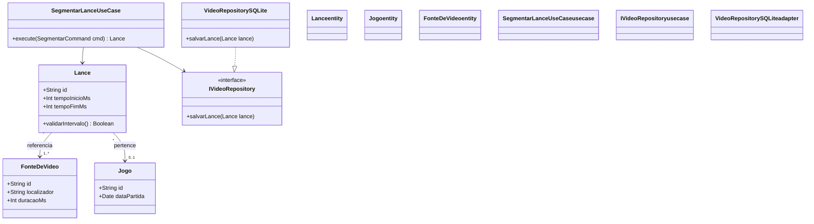
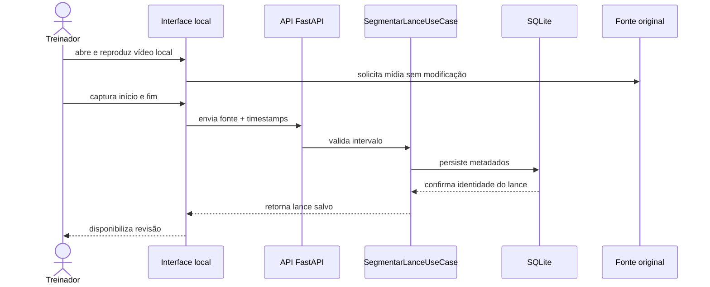

COMMON BLOCK | spec-anms

## Identification

<doc:schema_version>0.0</doc:schema_version>
<doc:file_type>spec-anms</doc:file_type>
<doc:form_block_cardinality>single</doc:form_block_cardinality>
<doc:language>pt</doc:language>

## Document State

<doc:document_status>approved</doc:document_status>

## Workflow

<doc:owner>architect</doc:owner>
<doc:commissioned_by>phase-planning</doc:commissioned_by>
<doc:consumed_by>implementer,review-agent</doc:consumed_by>

## Context

<doc:project>CEPRAEA — Sistema de Análise Audiovisual de Handebol de Praia</doc:project>
<doc:purpose>Definir em um único arquivo a Fundação, os Requisitos, a Arquitetura, a Especificação, a Estratégia de Testes e os Princípios de Design do projeto.</doc:purpose>
<doc:summary>Especificação ANMS completa dos Capítulos 1–6 do Sistema de Análise Audiovisual de Handebol de Praia do CEPRAEA.</doc:summary>

## References

<doc:related_docs>
  <doc:ref>SPEC_TEMPLATE.md</doc:ref>
  <doc:ref>docs/SYSTEM_SPEC.md</doc:ref>
  <doc:ref>docs/GAME_MODEL.md</doc:ref>
  <doc:ref>docs/TRACEABILITY.md</doc:ref>
  <doc:ref>docs/architecture/C4_MODEL.yaml</doc:ref>
  <doc:ref>docs/governance/DECISIONS.yaml</doc:ref>
</doc:related_docs>

## Provenance

<doc:created_by>codex</doc:created_by>
<doc:created_at>2026-09-27T00:03:58Z</doc:created_at>

FORM BLOCK | spec-anms

## Form Fields

<spec-anms:spec_format>ANMS</spec-anms:spec_format>
<spec-anms:fr_count>6</spec-anms:fr_count>
<spec-anms:nfr_count>1</spec-anms:nfr_count>
<spec-anms:completed_chapters>1,2,3,4,5,6</spec-anms:completed_chapters>
<spec-anms:component_count>4</spec-anms:component_count>

DETAIL BLOCK | CONTEÚDO PRINCIPAL DA ESPECIFICAÇÃO (ANMS / ANPS)

# Sistema de Análise Audiovisual de Handebol de Praia — AI-Native Spec (ANMS; Template CEPRAEA v4.1.0)

## Princípio de Design: STFB (Stable Top, Flexible Bottom)

A estrutura dos capítulos segue o Princípio das Dependências Estáveis (SDP). Os capítulos superiores são mais estáveis e abstratos; os inferiores são mais concretos e voláteis. Alterações nos capítulos inferiores não exigem revisão dos capítulos superiores por padrão, desde que não alterem comportamento, requisitos, arquitetura ou critérios de aceite. Caso alterem, o impacto deve ser reavaliado para cima.

```text
Capítulo 1: Fundação          ← Estável: Rígido / Mais Abstrato
Capítulo 2: Requisitos
Capítulo 3: Arquitetura
Capítulo 4: Especificação      ← Flexível: Volátil / Mais Concreto
Capítulo 5: Estratégia de Testes
Capítulo 6: Princípios de Design
```

Esta é uma especificação ANMS em arquivo único, classificada como `spec-anms`. O uso desse formato documental não substitui as autoridades de produto, domínio, arquitetura e governança definidas pelo projeto.

---

## Capítulo 1: Fundação (Stable Top)

### 1.1 Contexto

O CEPRAEA (Centro de Esportes e Prática de Esportes de Areia) necessita de um sistema de análise audiovisual especializado para apoiar o trabalho do treinador solo, Davi, responsável pela Seleção Adulta Feminina de Handebol de Praia. Sem uma comissão técnica fixa para catalogação e edição de vídeos, o treinador gasta um tempo desproporcional em tarefas manuais de recorte e organização de mídias originadas de múltiplas fontes, em vez de focar na análise tática e no desenvolvimento das atletas.

### 1.2 Problemas

- **[PROB-01] Fragmentação e carga manual de trabalho:** as gravações de jogos e treinos chegam em formatos heterogêneos e arquivos longos. O processo atual de recorte e catalogação de lances é manual, repetitivo e consome dezenas de horas semanais.
- **[PROB-02] Ausência de acervo centralizado e canal assíncrono:** os vídeos e recortes ficam dispersos em computadores locais e celulares. Não existe um acervo estruturado com buscas por metadados táticos nem um meio eficiente de entregar feedbacks individuais e coletivos de forma assíncrona para as atletas.

### 1.3 Objetivos

- **[OBJ-01] Automação da ingestão e catalogação sem edição destrutiva:** permitir que o treinador registre arquivos locais e realize a marcação ágil de lances e segmentos de fase, sem alterar ou recodificar o vídeo original.
- **[OBJ-02] Disponibilização futura do Portal das Atletas:** fornecer uma interface web interativa na qual as atletas possam acessar feedbacks individuais, análises táticas e coleções organizadas de lances. O portal não bloqueia o primeiro fluxo funcional.

### 1.4 Abordagem

A primeira implementação segue a arquitetura aprovada com riscos em `ADR-001`: monólito modular local-first, interface em React/TypeScript/Vite, backend local em Python/FastAPI e persistência SQLite. A implementação deve preservar a separação entre domínio, aplicação e infraestrutura. Clean Architecture e DDD são referências orientadoras, não decisões arquiteturais adicionais. A modelagem baseia-se em mídia imutável e metadados temporais: um lance é uma referência lógica sobre a fonte de vídeo, com `tempo_inicio` e `tempo_fim`, e não uma cópia física obrigatória.

### 1.5 Escopo

#### 1.5.1 No Escopo

- Ingestão e reprodução de mídias locais suportadas.
- Marcação de lances canônicos em duas passagens: marcação rápida e detalhamento posterior de metadados.
- Estruturas extensíveis para fases de ataque e defesa, ações, preparação, vantagem e demais taxonomias esportivas aprovadas.
- Organização de coleções de lances e geração futura de feedbacks individuais ou coletivos vinculados a atletas.

#### 1.5.2 Fora do Escopo

- Tomada de decisão autônoma por IA sem validação da autoridade esportiva.
- Edição pesada de vídeo, como efeitos visuais, chroma key ou renderização gráfica avançada.
- Autenticação biométrica ou reconhecimento facial automático de atletas na primeira fase.
- Portal, IA, clipes físicos e sincronização multicâmera como bloqueadores do primeiro fluxo funcional.
- Aquisição por YouTube ou outras fontes remotas e ingestão em lote no gate inicial; essas capacidades permanecem futuras e opcionais.

### 1.6 Restrições

- **[RES-01]:** o arquivo de vídeo bruto original **MUST** permanecer imutável e separado de derivados em todas as operações do sistema.
- **[RES-02]:** as funcionalidades essenciais de marcação, corte virtual e organização do acervo local **MUST** funcionar sem dependência obrigatória de API paga de inferência ou conexão contínua.

### 1.7 Limitações

- **[LIM-01]:** modelos de IA podem sugerir classificações e intervalos, mas a autoridade final sobre metadados táticos pertence exclusivamente a Davi.
- **[LIM-02]:** taxonomias e critérios em estado `PENDENTE` **MUST NOT** ser tratados como conjuntos fechados nem implementados como decisões confirmadas sem aprovação da autoridade esportiva.

### 1.8 Glossário

- **JOGO:** entidade que representa uma partida de handebol de praia entre duas equipes em uma competição específica.
- **FONTE_DE_VIDEO:** arquivo de vídeo local ou referência de proveniência remota que contém a gravação audiovisual total ou parcial de uma partida ou treino.
- **INTERVALO_DE_JOGO_NA_FONTE:** recorte temporal contínuo, definido por `tempo_inicio` e `tempo_fim`, dentro de uma `FONTE_DE_VIDEO`.
- **LANCE:** unidade fundamental de análise tática que descreve uma jogada completa com significado próprio no handebol de praia.
- **BOLA DE QUEBRA:** padrão cuja caracterização operacional depende da sequência tática definida no modelo de jogo do CEPRAEA.
- **BOLA DE CONTINUIDADE:** padrão em que fixações e passes sucessivos transportam a vantagem até uma atacante seguinte receber livre.
- **FIXAÇÃO COM BOLA:** ação em que a ameaça da portadora provoca resposta defensiva que nega sua infiltração e compromete a cobertura de outra atacante.
- **PREPARAÇÃO:** avaliação da jogadora em quatro dimensões observáveis: profundidade, apoios, orientação corporal e sincronia temporal.

### 1.9 Notação Normativa

Esta especificação utiliza as convenções das normas RFC 2119 e RFC 8174:

- **SHALL / MUST / DEVE:** exigência estritamente obrigatória.
- **SHOULD / RECOMENDADO:** recomendação que pode admitir exceção justificada.
- **MAY / OPCIONAL:** item inteiramente opcional.
- **Mapeamento EARS:** a palavra-chave `DEVE`, ou `shall`, nas cláusulas do Capítulo 2 é sinônimo do termo normativo `SHALL` da RFC 2119.

### 1.10 Papéis Humanos e Autoridade de Decisão

1. **Apresentador de Requisitos e Autoridade de Domínio:** Davi, responsável por visão, problemas, escopo, regras esportivas e taxonomias.
2. **Tomador de Decisões Críticas de Arquitetura:** autoridade técnica responsável por aprovar a arquitetura e as ADRs do Capítulo 3.
3. **Aprovador de Testes de Aceite (UAT):** Davi, responsável pela homologação final com vídeos e jogos reais.

---

## Capítulo 2: Requisitos (Sintaxe EARS & Fórmulas)

### 2.1 Requisitos Funcionais (Sintaxe EARS)

Os IDs preservam os namespaces `RF` e `RNF` adotados pelo projeto. EARS define a sintaxe das cláusulas sem criar um namespace paralelo ou renumerar o requisito de origem.

#### 2.1.1 Requisitos Ubíquos (Ubiquitous)

- **[RF-001]:** o Sistema DEVE permitir o cadastro e a recuperação de `COMPETICAO`.
  Em inglês: The System shall allow `COMPETICAO` registration and retrieval.
- **[RF-002]:** o Sistema DEVE permitir o cadastro e a recuperação de `JOGO` vinculado à respectiva `COMPETICAO`.
  Em inglês: The System shall allow `JOGO` registration and retrieval linked to its corresponding `COMPETICAO`.
- **[RF-012]:** o Sistema DEVE permitir registrar múltiplos `SEGMENTO_DE_FASE` por `LANCE`, mantendo separadas as fases da equipe com posse e da equipe analisada.
  Em inglês: The System shall allow multiple `SEGMENTO_DE_FASE` records per `LANCE`, keeping the phases of the team in possession and the analyzed team separate.
- **[RF-030]:** o Sistema DEVE preservar o arquivo de vídeo original bruto intacto e sem modificação.
  Em inglês: The System shall preserve the original raw video file intact and unmodified.

#### 2.1.2 Requisitos Orientados a Eventos (Event-driven)

- **[RF-008]:** QUANDO Davi marcar o início de um `LANCE` durante a reprodução, o Sistema DEVE capturar automaticamente o tempo corrente da `FONTE_DE_VIDEO`.
  Em inglês: WHEN Davi marks the start of a `LANCE` during playback, the System shall automatically capture the current time of the `FONTE_DE_VIDEO`.
- **[RF-009]:** QUANDO Davi marcar o fim de um `LANCE`, o Sistema DEVE capturar automaticamente um tempo final maior que o tempo inicial.
  Em inglês: WHEN Davi marks the end of a `LANCE`, the System shall automatically capture an end time greater than the start time.

#### 2.1.3 Requisitos Orientados a Estado (State-driven)

Nenhum requisito aprovado desta categoria nesta revisão.

#### 2.1.4 Requisitos de Comportamento Indesejado / Exceção (Unwanted behaviour)

Nenhum requisito aprovado desta categoria nesta revisão.

#### 2.1.5 Requisitos de Recursos Opcionais (Optional feature)

Nenhum requisito aprovado desta categoria nesta revisão.

#### 2.1.6 Requisitos Complexos (Complex)

Nenhum requisito aprovado desta categoria nesta revisão.

### 2.2 Requisitos Não-Funcionais e Métricas de Qualidade

- **[RNF-005]:** o Sistema DEVE manter o arquivo de vídeo original imutável e separado de metadados, anotações e derivados.
  Em inglês: The System shall keep the original video file immutable and separate from metadata, annotations, and derivatives.
- **Validade matemática do requisito:**

  $$\forall r \in R, \quad Valid(r) \iff Unambiguous(r) \land Verifiable(r)$$

- **Critérios mensuráveis de qualidade de requisitos:**

  - percentual de requisitos conformes a um padrão EARS: `100%`;
  - percentual de requisitos com critério ou cenário rastreável: alvo de `100%` antes da aprovação da especificação;
  - findings de ambiguidade não resolvidos: `0` antes da aprovação da especificação.

### 2.3 Propostas Não Normativas

#### 2.3.1 Capacidades Futuras

**Estado:** `PROPOSTA A VALIDAR` para os comportamentos; o Portal das Atletas está `FORA DO ESCOPO INICIAL` e pertence à visão futura conforme `PROD-001`.

**Autoridade de validação:** Davi.

**Condição de promoção:** entrada no plano de implementação, definição de proveniência e atribuição de IDs aprovados.

- **Portal das Atletas:** definir autenticação, publicação, sincronização, autorização e experiência de reprodução antes de criar requisitos normativos.
- **Ingestão em lote:** avaliar seleção de vários arquivos, isolamento de falhas e relatório consolidado.
- **Validação ampliada de intervalos:** avaliar limites contra duração conhecida e mensagens de correção, sem substituir `RF-008`, `RF-009` ou `RF-013`.
- **Fontes remotas:** manter YouTube e outras URLs como proveniência ou aquisição futura e opcional, sem dependência para o fluxo local.
- **Materialização parcial:** avaliar extração legítima por intervalo somente quando o mecanismo de aquisição remota for definido.

#### 2.3.2 Metas Experimentais

**Estado:** `PROPOSTA TÉCNICA`.

**Responsável pela avaliação:** autoridade técnica, com validação operacional de Davi.

- **Latência percebida da marcação:** usar 200 ms como hipótese de medição, não como `RNF-*`, até definir hardware, operação e método de aferição.
- **Armazenamento de metadados:** usar 50 MB por partida como hipótese de medição, não como `RNF-*`, até definir volume de lances, histórico, índices e método de aferição.
- **Critério de promoção:** estabelecer baseline reproduzível e então aprovar, ajustar ou rejeitar cada limite.

---

## Capítulo 3: Arquitetura

### 3.1 Conceito Arquitetural & Convenção de Diagramação

- **Padrão adotado:** monólito modular local-first, conforme `ADR-001` e `TECH-001`.
- **Stack incremental autorizada com riscos:** React/TypeScript/Vite, Python/FastAPI, SQLite, arquivos de mídia locais e HTTP/JSON local.
- **Princípios orientadores:** Clean Architecture e DDD podem orientar a separação entre domínio, aplicação e infraestrutura, mas não constituem decisões arquiteturais adicionais nem contratos obrigatórios, conforme `TECH-003`.
- **Estratégia de diagramação:** `docs/architecture/C4_MODEL.yaml` é a fonte arquitetural canônica; vistas de componentes e contêineres são derivadas e validadas contra esse modelo. Diagramas conceituais desta SPEC devem declarar estado, fonte e limites.

### 3.2 Componentes

**Estado:** `MODELAGEM ATUAL`.

**Fonte canônica:** [`docs/architecture/C4_MODEL.yaml`](docs/architecture/C4_MODEL.yaml).

**Vista Mermaid derivada:** [`docs/architecture/views/containers.mmd`](docs/architecture/views/containers.mmd).

O Form Block conta os quatro contêineres definidos no C4: Interface local, API local, Persistência experimental e Mídia local. Treinador e sistema são elementos de contexto, não componentes. O Portal das Atletas não aparece como implementado porque permanece `FORA DO ESCOPO INICIAL`.

### 3.3 Estrutura de Arquivos

**Estado:** `MODELAGEM ATUAL`, observada no repositório.

```text
analise-video/
├── frontend/                    # Interface local React/TypeScript/Vite
│   └── src/
├── backend/                     # API local Python/FastAPI
│   ├── src/cepraea_video/
│   └── tests/
├── docs/                        # SSOT, arquitetura, contexto e evidências
├── scripts/                     # Ferramentas de contexto, documentação e Git
├── tests/docs/                  # Testes das ferramentas documentais
└── SPEC-analise-video.md        # Esta especificação ANMS
```

As dependências de negócio devem apontar para abstrações internas. UI, persistência e ferramentas de mídia permanecem na periferia arquitetural.

### 3.4 Modelo de Domínio e Estado

**Estado:** `PROPOSTA TÉCNICA`.

**Fonte:** invariantes `INV-002` a `INV-005` e modelo mínimo de `docs/SYSTEM_SPEC.md`.

**Limite:** este diagrama orienta a discussão do schema e não substitui C4, migração ou contrato persistente aprovado.



Timestamps e demais fatos observáveis permanecem separados de interpretação, classificação e feedback. Um lance pode se relacionar a várias atletas, ações, coleções e fontes.

### 3.5 Comportamento e Fluxos Processuais

**Estado:** `PROPOSTA TÉCNICA`.

**Fonte:** fluxo funcional de `docs/SYSTEM_SPEC.md` e gate observado em `ADR-001`.

**Limite:** nomes de casos de uso e interfaces permanecem sujeitos ao schema do incremento correspondente.



### 3.6 Registros de Decisão de Arquitetura (ADR)

#### ADR-001: Arquitetura local-first da primeira implementação

- **Status:** `APROVADA COM RISCOS` para implementação incremental; a stack definitiva permanece pendente.
- **Contexto:** o primeiro fluxo requer reprodução local, captura de timestamps, persistência, revisão e preservação do original sem dependência de cloud.
- **Decisão:** usar provisoriamente um monólito modular local-first com React/TypeScript/Vite, Python/FastAPI, SQLite e HTTP/JSON local.
- **Consequências:**
  - **Positivas:** operação local, separação entre UI, aplicação, persistência e mídia, além de ausência de cloud obrigatória.
  - **Negativas / riscos:** empacotamento, compatibilidade ampla de mídias, precisão perceptiva e schema definitivo ainda precisam de validação.
- **Metadados:**
  - **Owner:** autoridade técnica do projeto.
  - **Decision Authority:** Davi Sermenho.
  - **Provenance:** `docs/architecture/ADR-001-primeira-implementacao.md` e `TECH-001`.

---

## Capítulo 4: Especificação (BDD & Catálogo Condicional)

### 4.1 Cenários e Critérios de Aceitação em Gherkin

```gherkin
# language: pt
Funcionalidade: Catálogo e marcação local de lances
  Como treinador
  Quero organizar jogos e criar marcações temporais sobre vídeos locais
  Para estruturar o acervo tático sem alterar os vídeos originais

  Regra: Competição e jogo preservam identidade e vínculo

    @RF-001
    Cenário: SC-CAD-001 Cadastrar e recuperar competição
      Dado que os dados de uma nova competição foram informados
      Quando Davi cadastrar a competição
      Então o Sistema deve recuperar a competição com sua identidade preservada

    @RF-002
    Cenário: SC-CAD-002 Cadastrar jogo vinculado à competição
      Dado que uma competição está cadastrada
      Quando Davi cadastrar um jogo nessa competição
      Então o Sistema deve recuperar o jogo com o vínculo para a competição

  Regra: Tempos do lance são capturados a partir da reprodução

    @RF-008 @RF-009
    Cenário: SC-MAR-001 Capturar início e fim de um lance
      Dado que uma FONTE_DE_VIDEO local está em reprodução
      Quando Davi marcar o início e depois o fim de um lance
      Então o Sistema deve capturar ambos os tempos sem digitação manual
      E o tempo final deve ser maior que o tempo inicial

  Regra: Fases das equipes permanecem independentes

    @RF-012
    Cenário: SC-FAS-001 Registrar múltiplos segmentos de fase
      Dado que um LANCE possui equipe com posse e equipe analisada
      Quando Davi classificar as fases observadas no lance
      Então o Sistema deve permitir múltiplos SEGMENTO_DE_FASE
      E deve manter separadas as fases de cada equipe

  Regra: O original permanece imutável

    @RF-030 @RNF-005
    Cenário: SC-MID-001 Preservar a fonte original
      Dado que o hash da FONTE_DE_VIDEO original foi registrado
      Quando Davi marcar, salvar e rever um lance
      Então o hash do arquivo original deve permanecer idêntico
      E metadados e derivados devem permanecer separados do original
```

**Resultado:** `SKIP` — cenários definidos, ainda não executados como parte desta revisão documental.

**Remark / Observação:** os cenários cobrem os seis requisitos funcionais e o requisito não funcional normativos listados nesta revisão. A execução e a evidência continuam regidas por `docs/TRACEABILITY.md`.

### 4.2+ Catálogo Condicional de Seções

#### 4.2 Especificação de Interface do Usuário (UI/UX)

- **Contrato visual:** `PENDENTE` — protótipo ou wireframe ainda não referenciado nesta especificação.
- **Comportamento de UI:**
  - **[UI-001] Player de análise rápida:** tela com reprodutor de vídeo, linha do tempo com marcações e painel de atalhos.
  - **[UI-002] Portal das Atletas — `FORA DO ESCOPO INICIAL`:** interface responsiva futura com feedbacks e coleções, sem bloquear o fluxo local inicial. Seus comportamentos permanecem `PROPOSTA A VALIDAR`.

---

## Capítulo 5: Estratégia de Testes

### 5.1 Matriz de Cobertura e Níveis de Teste

| Nível de Teste | Alvo / Escopo | Política de Execução / Responsável | Ferramenta / Framework | Critério de Aceite / Pass |
| --- | --- | --- | --- | --- |
| Unitário | Entidades, regras e casos de uso | Agente de IA ou engenharia, a cada alteração pertinente | PyTest / Vitest | Pass rate de 100% e cobertura definida pelo incremento |
| Integração | FastAPI, SQLite, acesso à mídia e adaptadores | Pipeline e verificação local | PyTest | Persistência, recuperação e imutabilidade aprovadas |
| Desempenho / RNF | Imutabilidade e futuras métricas de marcação/armazenamento | Verificação no ambiente de referência | SHA-256 e ferramenta definida pelo incremento | RNF-005 aprovado; hipóteses de 200 ms e 50 MB sem critério de aprovação até existir baseline |
| E2E / Sistema | Cenários do Capítulo 4.1 | Agente de IA ou QA | Playwright | Todos os cenários aplicáveis em `PASS` |
| Aceite (UAT) | Fluxo completo com vídeos reais | Davi, autoridade de domínio | Inspeção manual e evidência reproduzível | Aprovado sem bloqueadores |

### 5.2 Política de Execução

1. **Isolamento STFB:** alterações nos Capítulos 4 ou 5 não exigem revisão dos Capítulos 1–3 por padrão se não alterarem comportamento, requisitos, arquitetura ou critérios de aceite; caso contrário, o impacto deve ser reavaliado para cima.
2. **Execução e gatilhos:** testes unitários e de integração devem ser executados a cada alteração de código pertinente; build e testes E2E devem ser executados antes da integração; UAT deve ocorrer nos gates definidos para incrementos com experiência operacional.
3. **Evidência:** código existente, isoladamente, não comprova funcionalidade. O estado `VERIFIED` depende de teste e evidência reproduzível correspondente.

---

## Capítulo 6: Conformidade com Princípios de Design (Meta-QA)

Checklist baseline extensível para revisão da implementação:

| Categoria | Identificador | Nome do Princípio | Perspectiva de Revisão / Verificação |
| --- | --- | --- | --- |
| Nomeação | Naming | Nomeação Expressiva | Os nomes transmitem intenção e são consistentes com o Glossário? |
| Dependências | Dep Direction | Direção de Dependência | As dependências apontam para módulos mais estáveis? |
| Dependências | SDP | Stable Dependencies | Cada módulo depende de abstrações mais estáveis do que ele próprio? |
| Simplicidade | KISS | Keep It Simple, Stupid | A solução é a mais simples que atende aos requisitos? |
| Simplicidade | YAGNI | You Aren't Gonna Need It | Há recursos implementados fora do escopo aprovado? |
| Simplicidade | DRY | Don't Repeat Yourself | Há duplicação desnecessária de regras ou validações? |
| Separação | SoC | Separation of Concerns | UI, aplicação, domínio e infraestrutura estão separados? |
| Separação | SRP | Single Responsibility | Cada módulo possui uma única razão bem definida para mudar? |
| Separação | SLAP | Single Level of Abstraction | As funções mantêm nível homogêneo de abstração? |
| SOLID | OCP | Open-Closed Principle | A solução aceita extensão sem exigir modificação indevida? |
| SOLID | LSP | Liskov Substitution | Implementações podem substituir abstrações sem quebrar contratos? |
| SOLID | ISP | Interface Segregation | As interfaces são coesas e específicas para seus clientes? |
| SOLID | DIP | Dependency Inversion | Casos de uso dependem de abstrações, e não de implementações? |
| Acoplamento | LoD | Law of Demeter | O código evita navegar em estruturas internas de terceiros? |
| Acoplamento | CQS | Command-Query Separation | Comandos e consultas permanecem separados? |
| Legibilidade | POLA | Least Astonishment | O comportamento é previsível para usuários e mantenedores? |
| Legibilidade | PIE | Program Expressively | O código expressa com clareza a intenção do domínio? |
| Testabilidade | Testability | Testabilidade | É possível testar regras isoladamente e substituir dependências? |
| Pureza | Pure/Impure | Funções Puras | Lógica pura está separada de efeitos colaterais? |
| Estado | State Transition | Transições de Estado | Condições e execução das transições estão separadas? |
| Concorrência | Concurrency | Segurança Concorrente | Há proteção contra condições de corrida e inconsistências? |
| Erros | Error Handling | Tratamento de Erros | Falhas são propagadas e tratadas sem captura silenciosa? |
| Recursos | Lifecycle | Ciclo de Vida | Aquisição e liberação de arquivos, conexões e memória estão emparelhadas? |
| Imutabilidade | Immutability | Imutabilidade | Originais e valores que não devem mudar permanecem imutáveis? |
| Eficiência | Resource Efficiency | Eficiência de Recursos | CPU, memória e armazenamento respeitam os limites definidos? |

---

## Apêndice

### A.1 Referências

- **[REF-01]:** `SPEC_TEMPLATE.md` — Template CEPRAEA v4.1.0.
- **[REF-02]:** `docs/SYSTEM_SPEC.md` — requisitos e primeiro fluxo funcional.
- **[REF-03]:** `docs/GAME_MODEL.md` — significado esportivo do modelo CEPRAEA.
- **[REF-04]:** `docs/architecture/ADR-001-primeira-implementacao.md` — arquitetura incremental local-first.
- **[REF-05]:** `docs/architecture/C4_MODEL.yaml` — fonte arquitetural estruturada canônica.
- **[REF-06]:** `docs/governance/DECISIONS.yaml` — decisões e estados aprovados.
- **[REF-07]:** RFC 2119 e RFC 8174 — termos normativos.
- **[REF-08]:** EARS — Easy Approach to Requirements Syntax.
- **[REF-09]:** Cucumber Gherkin Reference.

### A.2 Licenças

O relatório consolidado de licenças de bibliotecas e dependências de terceiros permanece `PENDENTE`. Esta seção não concede licença adicional nem substitui os arquivos de licença das dependências.

### A.3 Histórico de Alterações (Resumo Derivado)

| Data (UTC) | Versão | Autor / Agente | Descrição da Alteração |
| --- | --- | --- | --- |
| 2026-09-18 | v3.0 | srs-writer | Versão anterior da especificação em estrutura própria. |
| 2026-09-27 | v3.1 | codex | Adequação estrutural ao template CEPRAEA v4.1.0, preservando autoridades e namespaces do projeto. |
| 2026-09-27 | v3.2 | codex | Reconciliação semântica de IDs, escopo futuro do portal, propostas técnicas e autoridade C4. |
| 2026-09-27 | v3.3 | Davi Sermenho | Aprovação da publicação integral e promoção do estado editorial. |

FOOTER | append change_log entry on every write

## Last Updated

<doc:updated_by>codex</doc:updated_by>
<doc:updated_at>2026-09-27T01:42:18Z</doc:updated_at>

## Change Log

<doc:change_log>
  <doc:entry at="2026-09-18" by="srs-writer" action="created" />
  <doc:entry at="2026-09-27T00:03:58Z" by="codex" action="restructured-to-template-v4.1.0" />
  <doc:entry at="2026-09-27T01:26:14Z" by="codex" action="reconciled-semantic-decisions" />
  <doc:entry at="2026-09-27T01:30:41Z" by="codex" action="aligned-detail-block-label" />
  <doc:entry at="2026-09-27T01:35:37Z" by="codex" action="resolved-architect-review-findings" />
  <doc:entry at="2026-09-27T01:42:18Z" by="Davi Sermenho" action="approved-for-publication" />
</doc:change_log>
