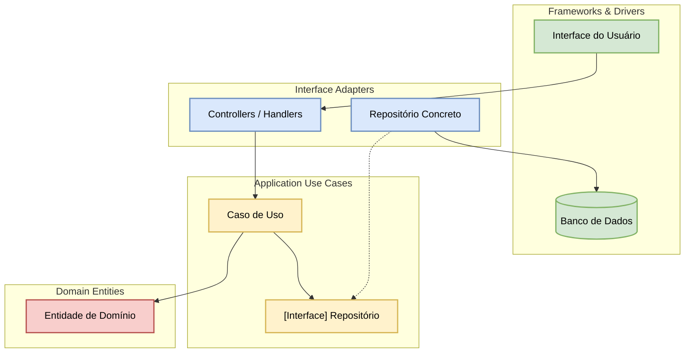

[TMPL-03] Spec Template v4.1.0
ANMS SINGLE-FILE — CEPRAEA SCHEMA EXTENSION

CABEÇALHO PARA spec-anms (Ch 1–6) — Arquivo: {project}-spec.md

REGRA DE CLASSIFICAÇÃO
`spec-anms` é um file_type próprio da extensão CEPRAEA para uma especificação ANMS completa em arquivo único. Ele NÃO substitui nem modifica os file_types upstream `spec-foundation` e `spec-architecture`, que permanecem reservados ao ANPS split. O namespace do Form Block é `spec-anms:`.

```md
COMMON BLOCK | spec-anms

## Identification

<doc:schema_version>0.0</doc:schema_version>
<doc:file_type>spec-anms</doc:file_type>
<doc:form_block_cardinality>single</doc:form_block_cardinality>
<doc:language>pt</doc:language>

## Document State

<doc:document_status>draft</doc:document_status>

## Workflow

<doc:owner>architect</doc:owner>
<doc:commissioned_by>phase-planning</doc:commissioned_by>

<doc:consumed_by>implementer,review-agent</doc:consumed_by>

## Context

<doc:project>{project-name}</doc:project>
<doc:purpose>Definir em um único arquivo a Fundação, Requisitos, Arquitetura, Especificação, Estratégia de Testes e Princípios de Design do projeto sob ANMS.</doc:purpose>
<doc:summary>Especificação ANMS completa dos Capítulos 1–6 do projeto {project-name}.</doc:summary>

## References

<doc:related_docs>
  <doc:ref>{related-doc}</doc:ref>
</doc:related_docs>

## Provenance

<doc:created_by>{agent-name}</doc:created_by>
<doc:created_at>{ISO-8601-timestamp}</doc:created_at>

FORM BLOCK | spec-anms

## Form Fields

<spec-anms:spec_format>ANMS</spec-anms:spec_format>
<spec-anms:fr_count>{int}</spec-anms:fr_count>
<spec-anms:nfr_count>{int}</spec-anms:nfr_count>
<!-- completed_chapters é estado do documento. Valores permitidos: qualquer subconjunto ordenado de 1,2,3,4,5,6. -->
<spec-anms:completed_chapters>{completed-chapters}</spec-anms:completed_chapters>
<!-- component_count é obrigatório quando o Capítulo 3 estiver concluído; antes disso pode permanecer não preenchido. -->
<spec-anms:component_count>{int}</spec-anms:component_count>
<!-- api_endpoint_count é opcional; remova a tag na instanciação quando não for aplicável. -->
<spec-anms:api_endpoint_count>{int}</spec-anms:api_endpoint_count>
<!-- migration_count é opcional; remova a tag na instanciação quando não for aplicável. -->
<spec-anms:migration_count>{int}</spec-anms:migration_count>
```

OWNERSHIP
O `spec-anms` possui um único owner de arquivo: `architect`, responsável por Common Block e Form Block. O `srs-writer` pode contribuir com Ch1–2 no Detail Block sob a exceção de Detail Block da [REF-01], registrando a escrita no change_log. Isso preserva o princípio upstream de um único owner por arquivo sem dividir o ANMS em dois documentos.

SNIPPETS DE BLOCOS DE CABEÇALHO PARA ANPS (NÍVEL 2 - ARQUIVOS SPLIT)

1. CABEÇALHO PARA spec-foundation (Ch 1–2) — Arquivo: {project}-spec-ch1-2.md

```md
COMMON BLOCK | spec-foundation

## Identification

<doc:schema_version>0.0</doc:schema_version>
<doc:file_type>spec-foundation</doc:file_type>
<doc:form_block_cardinality>single</doc:form_block_cardinality>
<doc:language>pt</doc:language>

## Document State

<doc:document_status>draft</doc:document_status>

## Workflow

<doc:owner>srs-writer</doc:owner>
<doc:commissioned_by>phase-planning</doc:commissioned_by>
<doc:consumed_by>architect,review-agent</doc:consumed_by>

## Context

<doc:project>{project-name}</doc:project>
<doc:purpose>Definir os requisitos de negócio, visão, escopo e requisitos funcionais/não-funcionais do sistema sob a metodologia ANMS/ANPS.</doc:purpose>
<doc:summary>Especificação da Fundação (Capítulo 1) e Requisitos (Capítulo 2) do projeto {project-name}.</doc:summary>

## References

<doc:related_docs>
  <doc:ref>docs/spec/{project-name}-spec-ch3-6.md</doc:ref>
</doc:related_docs>

## Provenance

<doc:created_by>{agent-name}</doc:created_by>
<doc:created_at>{ISO-8601-timestamp}</doc:created_at>

FORM BLOCK | spec-foundation

## Form Fields

<spec-foundation:spec_format>ANPS</spec-foundation:spec_format>
<spec-foundation:fr_count>{int}</spec-foundation:fr_count>
<spec-foundation:nfr_count>{int}</spec-foundation:nfr_count>

<!-- completed_chapters é estado do documento. Valores permitidos: subconjunto de 1,2 (ex.: 1 ou 1,2). -->
<spec-foundation:completed_chapters>{completed-chapters}</spec-foundation:completed_chapters>
```

2. CABEÇALHO PARA spec-architecture (Ch 3–6) — Arquivo: {project}-spec-ch3-6.md

```md
COMMON BLOCK | spec-architecture

## Identification

<doc:schema_version>0.0</doc:schema_version>
<doc:file_type>spec-architecture</doc:file_type>
<doc:form_block_cardinality>single</doc:form_block_cardinality>
<doc:language>pt</doc:language>

## Document State

<doc:document_status>draft</doc:document_status>

## Workflow

<doc:owner>architect</doc:owner>
<doc:commissioned_by>phase-design</doc:commissioned_by>
<doc:consumed_by>implementer,review-agent</doc:consumed_by>

## Context

<doc:project>{project-name}</doc:project>
<doc:purpose>Definir a estrutura arquitetural, especificações de detalhe, estratégia de testes e conformidade técnica do sistema.</doc:purpose>
<doc:summary>Especificação da Arquitetura (Capítulo 3), Especificação BDD (Capítulo 4), Estratégia de Testes (Capítulo 5) e Princípios de Design (Capítulo 6).</doc:summary>

## References

<doc:related_docs>
  <doc:ref>docs/spec/{project-name}-spec-ch1-2.md</doc:ref>
</doc:related_docs>

## Provenance

<doc:created_by>{agent-name}</doc:created_by>
<doc:created_at>{ISO-8601-timestamp}</doc:created_at>

FORM BLOCK | spec-architecture

## Form Fields

<spec-architecture:spec_format>ANPS</spec-architecture:spec_format>
<!-- completed_chapters é estado do documento. Valores permitidos: subconjunto de 3,4,5,6 (ex.: 3,4 ou 3,4,5,6). -->
<spec-architecture:completed_chapters>{completed-chapters}</spec-architecture:completed_chapters>
<!-- component_count é obrigatório quando o Capítulo 3 estiver concluído; antes disso pode permanecer não preenchido. -->
<spec-architecture:component_count>{int}</spec-architecture:component_count>

<!-- api_endpoint_count é opcional; remova a tag na instanciação quando não for aplicável. -->
<spec-architecture:api_endpoint_count>{int}</spec-architecture:api_endpoint_count>

<!-- migration_count é opcional; remova a tag na instanciação quando não for aplicável. -->
<spec-architecture:migration_count>{int}</spec-architecture:migration_count>
```

[CEPRAEA-GOVERNANCE-EXTENSION / optional]

Esta seção contém metadados de governança da Control Database CEPRAEA.
Ela é mantida na instanciação do documento quando o projeto utiliza o ecossistema CEPRAEA.
ESTES CAMPOS NÃO FAZEM PARTE DO SCHEMA UPSTREAM [REF-01].

**Metadados de Governança CEPRAEA [CEPRAEA-GOVERNANCE-EXTENSION / optional]**

- document_object_id: "{document_object_id}"
- document_version: "{document_version}"
- target_system: "{target_system}"
- task_contract_id: "{task_contract_id}"
- prompt_id: "{prompt_id}"
- context_manifest_id: "{context_manifest_id}"
- source_ids: ["{source_id_1}", "{source_id_2}"]
- source_snapshot_id: "{source_snapshot_id}"

DETAIL BLOCK | CONTEÚDO PRINCIPAL DA ESPECIFICAÇÃO (ANMS / ANPS)

# [NOME_DO_PROJETO] — AI-Native Spec (ANMS; Template CEPRAEA v4.1.0)

## Princípio de Design: STFB (Stable Top, Flexible Bottom)

Estrutura de capítulos baseada no Princípio das Dependências Estáveis (SDP). Os capítulos superiores são estáveis e abstratos (baixa frequência de alteração); os capítulos inferiores são concretos e voláteis (alta frequência de alteração). Alterações nos capítulos inferiores pretendem limitar o impacto de regressão e não exigem modificação dos capítulos superiores por padrão SE não alterarem comportamento, requisitos, arquitetura ou critérios de aceite; caso contrário, reavaliar impacto para cima.

```txr
Capítulo 1: Fundação          ← Estável: Rígido / Mais Abstrato
Capítulo 2: Requisitos
Capítulo 3: Arquitetura
Capítulo 4: Especificação      ← Flexível: Volátil / Mais Concreto
Capítulo 5: Estratégia de Testes
Capítulo 6: Princípios de Design
```

Este template suporta escalonamento em três níveis: ANMS (arquivo único Ch1–6, classificado obrigatoriamente como file_type spec-anms), ANPS (múltiplos arquivos split: spec-foundation para Ch1–2 e spec-architecture para Ch3–6) e ANGS (especificação mantida em banco de dados em grafo). Para ANMS single-file, NÃO usar spec-foundation nem spec-architecture como file_type do documento completo.

---

## Capítulo 1: Fundação (Stable Top)

### 1.1 Contexto

[Descreva o contexto de negócio, o cenário atual do domínio e a motivação primária para a existência do sistema.]

### 1.2 Problemas

- [PROB-01]: [Descrição do problema principal enfrentado pelos usuários ou pela operação]
- [PROB-02]: [Descrição do problema secundário ou limitação técnica atual]

### 1.3 Objetivos

- [OBJ-01]: [Objetivo mensurável de negócio ou produto]
- [OBJ-02]: [Objetivo de desempenho, qualidade ou eficiência operacional]

### 1.4 Abordagem

[Descreva a abordagem técnica e conceitual adotada para resolver os problemas, ex.: Event-Driven Architecture, Clean Architecture, Serverless.]

### 1.5 Escopo

#### 1.5.1 No Escopo

- [Funcionalidade, capacidade ou fluxo 1 incluído nesta entrega]
- [Funcionalidade ou capacidade 2]

#### 1.5.2 Fora do Escopo

- [Funcionalidade ou integração explicitamente excluída desta versão]
- [Recurso diferido para fases futuras]

### 1.6 Restrições

- [RES-01]: [Restrição técnica, legal, regulatória ou de segurança inegociável]
- [RES-02]: [Restrição de infraestrutura, custo de API ou latência limite]

### 1.7 Limitações

- [LIM-01]: [Compromisso de design conhecido / concessão intencional entre o Escopo (o que não será feito) e Restrições (o que não pode ser quebrado) para ajudar a reduzir a sobre-engenharia da IA]

### 1.8 Glossário

- [Termo 1]: [Definição precisa do conceito do domínio/negócio. Alinha o vocabulário entre a IA e humanos]
- [Termo 2]: [Definição de sigla ou conceito técnico]

### 1.9 Notação Normativa

Esta especificação utiliza as convenções das normas RFC 2119 e RFC 8174:

- SHALL / MUST / DEVE: Indica que o item é uma exigência estritamente obrigatória.
- SHOULD / RECOMENDADO: Indica que o item é uma recomendação, mas podem existir razões válidas para não segui-lo em casos específicos.
- MAY / OPCIONAL: Indica que o item é totalmente opcional.
- Mapeamento EARS: A palavra-chave deve (ou shall) nas cláusulas do Capítulo 2 é formalmente declarada como sinônimo exato do termo normativo SHALL da RFC 2119.

### 1.10 Papéis Humanos e Autoridade de Decisão

[Define a atribuição das autoridades humanas indispensáveis no ciclo de desenvolvimento do projeto:]

1. Apresentador de Requisitos: Autoridade de produto/domínio responsável pela visão, problemas e escopo do Capítulo 1.
2. Tomador de Decisões Críticas de Arquitetura: Autoridade técnica responsável por aprovar a arquitetura e ADRs do Capítulo 3.
3. Aprovador de Testes de Aceite (UAT): Autoridade responsável pela homologação final com base nos cenários do Capítulo 4.

---

## Capítulo 2: Requisitos (Sintaxe EARS & Fórmulas)

### 2.1 Requisitos Funcionais (Sintaxe EARS)

#### 2.1.1 Requisitos Ubíquos (Ubiquitous)

- [REQ-EARS-001]: O [NOME_DO_SISTEMA] DEVE [RESPOSTA_DO_SISTEMA].
  Em inglês: The [NOME_DO_SISTEMA] shall [RESPOSTA_DO_SISTEMA].

#### 2.1.2 Requisitos Orientados a Eventos (Event-driven)

- [REQ-EARS-002]: QUANDO [GATILHO_DISCRETO], o [NOME_DO_SISTEMA] DEVE [RESPOSTA_DO_SISTEMA].
  Em inglês: WHEN [GATILHO_DISCRETO], the [NOME_DO_SISTEMA] shall [RESPOSTA_DO_SISTEMA].

#### 2.1.3 Requisitos Orientados a Estado (State-driven)

- [REQ-EARS-003]: ENQUANTO [ESTADO_ESPECIFICO], o [NOME_DO_SISTEMA] DEVE [RESPOSTA_DO_SISTEMA].
  Em inglês: WHILE [ESTADO_ESPECIFICO], the [NOME_DO_SISTEMA] shall [RESPOSTA_DO_SISTEMA].

#### 2.1.4 Requisitos de Comportamento Indesejado / Exceção (Unwanted behaviour)

- [REQ-EARS-004]: SE [CONDICAO_DE_FALHA_OU_ERRO], ENTÃO o [NOME_DO_SISTEMA] DEVE [RESPOSTA_DE_MITIGACAO].
  Em inglês: IF [CONDICAO_DE_FALHA_OU_ERRO], THEN the [NOME_DO_SISTEMA] shall [RESPOSTA_DE_MITIGACAO].

#### 2.1.5 Requisitos de Recursos Opcionais (Optional feature)

- [REQ-EARS-005]: ONDE [RECURSO_OPCIONAL_INCLUIDO], o [NOME_DO_SISTEMA] DEVE [RESPOSTA_DO_SISTEMA].
  Em inglês: WHERE [RECURSO_OPCIONAL_INCLUIDO], the [NOME_DO_SISTEMA] shall [RESPOSTA_DO_SISTEMA].

#### 2.1.6 Requisitos Complexos (Complex)

- [REQ-EARS-006]: QUANDO [GATILHO_DISCRETO], ENQUANTO [ESTADO_ESPECIFICO], o [NOME_DO_SISTEMA] DEVE [RESPOSTA_DO_SISTEMA].
  Em inglês: WHEN [GATILHO_DISCRETO], WHILE [ESTADO_ESPECIFICO], the [NOME_DO_SISTEMA] shall [RESPOSTA_DO_SISTEMA].

### 2.2 Requisitos Não-Funcionais e Métricas de Qualidade

- [NFR-001]: [Requisito de Desempenho, Segurança ou Disponibilidade quantificado]
- Critérios Mensuráveis de Qualidade de Requisitos:
  - % de requisitos conformes a um padrão EARS >= {target}%
  - % de requisitos com critério/cenário rastreável >= {target}%
  - findings de ambiguidade não resolvidos <= {threshold}

---

## Capítulo 3: Arquitetura

### 3.1 Conceito Arquitetural & Convenção de Diagramação

- Padrão Adotado: [DEFAULT/EXAMPLE - removível: Clean Architecture. Podendo ser substituído por Hexagonal, Event-Driven, Monólito Modular ou Microsserviços conforme declaração do projeto].
- Estratégia de Diagramação: [Declarar a linguagem/ferramenta de diagramação adotada pela instância, ex.: Mermaid.js, PlantUML ou ASCII. A legenda de cores/estilos deve ser definida abaixo].

[DEFAULT/EXAMPLE - removível — Legenda Clean Architecture (4 Camadas)]
- Entity (#f8cecc - Rosa): Entidades de Domínio e Regras de Negócio Críticas
- Use Case (#fff2cc - Amarelo): Casos de Uso da Aplicação
- Adapter (#dae8fc - Azul): Controllers, Presenters, Gateways, Mapeadores
- Framework (#d5e8d4 - Verde): Banco de Dados, UI, Web/Mobile, Drivers e Serviços Externos

### 3.2 Componentes

[Particionamento das partes do sistema, responsabilidades e diagrama de componentes com a legenda definida em 3.1.]

[DEFAULT/EXAMPLE - removível: Mermaid com classDef para Clean Architecture]



### 3.3 Estrutura de Arquivos

[Estrutura de diretórios do projeto e mapeamento de dependências entre módulos/componentes do diagrama 3.2 e pastas do código-fonte.]

[DEFAULT/EXAMPLE - removível]

```txr
{project-root}/
├── src/
│   ├── domain/        # Entidades e Regras de Negócio (Entity Layer)
│   ├── application/   # Casos de Uso e Interfaces (UseCase Layer)
│   ├── adapters/      # Controllers e Implementações de Repositório (Adapter Layer)
│   └── infrastructure/# Frameworks, DB, HTTP, Drivers (Framework Layer)
└── tests/
```

### 3.4 Modelo de Domínio e Estado

[Diagrama de classes, modelo entidade-relacionamento (ER) e/ou diagramas de transição de estado que definem as estruturas de dados e ciclo de vida do domínio.]

### 3.5 Comportamento e Fluxos Processuais

[Fluxos de processos e interações dinâmicas entre componentes representados via Diagramas de Sequência ou Diagramas de Atividades.]

### 3.6 Registros de Decisão de Arquitetura (ADR)

[Decisões técnicas relevantes documentadas no formato Michael Nygard.]

#### ADR-001: [Título da Decisão Arquitetural]

- Status: [PROPOSED | APPROVED | REJECTED | SUPERSEDED]
- Contexto: [Qual é o problema, necessidade ou trade-off técnico enfrentado?]
- Decisão: [Qual tecnologia, padrão ou arquitetura foi selecionada?]
- Consequências:
  - Positivas: [Benefícios obtidos]
  - Negativas / Riscos: [Trade-offs aceitos e custos de manutenção]
- Metadados Opcionais:
  - Owner: [Responsável técnico pela proposição]
  - Decision Authority: [Autoridade humana/comitê que aprovou]
  - Provenance: [Sessão, discussão ou issue de origem]

---

## Capítulo 4: Especificação (BDD & Catálogo Condicional)

### 4.1 Cenários e Critérios de Aceitação em Gherkin

```gherkin
# language: pt
Funcionalidade: [Nome da Funcionalidade]

  Contexto:
    Dado [Pré-condição comum a todos os cenários]

  Regra: [Nome da Regra de Negócio]

    @REQ-EARS-002
    Cenário: SC-001 [Título do Cenário Sucesso] (rastros: REQ-EARS-002)
      Dado [Estado inicial ou pré-condição]
      Quando [Ação ou evento disparado]
      Então [Resultado esperado observável]
      E [Verificação adicional]

    @REQ-EARS-004
    Cenário: SC-002 [Título do Cenário de Exceção] (rastros: REQ-EARS-004)
      Dado [Estado inicial]
      Quando [Ocorrer uma falha ou entrada inválida]
      Então [O sistema deve exibir mensagem de erro de mitigação]
      Mas [Comportamento indesejado que NÃO deve ocorrer]
```

Resultado: PASS | CONDITIONAL | FAIL | SKIP
Remark / Observação: [Anotações da execução de teste automatizado ou revisão humana]

---

### 4.2+ Catálogo Condicional de Seções (Selecione conforme a natureza do projeto)

#### 4.2 Especificação de Interface do Usuário (UI/UX - Opcional)

- Contrato Visual: [Link para protótipo Figma / Wireframe]
- Comportamento de UI:
  - [UI-001]: [Regra de exibição de campo, estado de botão ou feedback visual]
  - [UI-002]: [Comportamento de acessibilidade, responsividade ou estados de erro]

#### 4.3 Especificação de Configuração & Parâmetros (Opcional)

- [CFG-001]: [Variável de ambiente, arquivo de configuração ou flag de funcionalidade]

#### 4.4 Definição de API & Contratos de Comunicação (Opcional)

- [API-001]: [Endereço de endpoint, método HTTP, esquema de requisição/resposta ou tópico de evento]

#### 4.5 Esquema de Dados & Persistência (Opcional)

- [DAT-001]: [Esquema de tabela, índices, regras de migração ou restrições de banco de dados]

#### 4.6 Gerenciamento de Estado (Opcional)

- [STT-001]: [Máquina de estados, persistência de sessão ou estratégia de cache]

#### 4.7 Algoritmos e Lógica de Negócio Detalhada (Opcional)

- [ALG-001]: [Fórmula de cálculo, regras de ordenação ou lógica de processamento em lote]

#### 4.8 Tratamento de Erros e Resiliência (Opcional)

- [ERR-001]: [Políticas de retentativa, circuit breaker, fallback ou códigos de erro padrão]

---

## Capítulo 5: Estratégia de Testes

### 5.1 Matriz de Cobertura e Níveis de Teste

[DEFAULT/EXAMPLE - removível: Ajuste as linhas, papéis e ferramentas conforme a política do projeto]

| Nível de Teste | Alvo / Escopo | Política de Execução / Responsável | Ferramenta / Framework | Critério de Aceite / Pass |
| --- | --- | --- | --- | --- |
| Unitário | Regras de negócio, Entidades e Casos de Uso | [Configurável: Agente de IA / Engenheiro] | [ex.: Vitest / PyTest] | Cobertura >= X%, Pass Rate 100% |
| Integração | Repositórios, Adaptadores e APIs | [Configurável: Agente de IA / CI Pipeline] | [ex.: Testcontainers / Supertest] | Pass Rate 100% |
| Desempenho / NFR | Endpoints e algoritmos críticos | [Configurável: Pipeline de Carga] | [ex.: k6 / JMeter] | Conforme métricas do Cap. 2.2 |
| E2E / Sistema | Cenários do Cap. 4.1 (Gherkin) | [Configurável: Agente de IA / QA Engineer] | [ex.: Playwright / Cypress] | Todos os cenários PASS |
| Aceite (UAT) | Validação final de entrega de valor | [Configurável: Humano no Loop (Papel 3)] | Inspeção manual / UAT | Aprovado sem bloqueadores |

### 5.2 Política de Execução

1. Isolamento STFB: Alterações nos testes dos Capítulos 4 ou 5 não exigem revisão dos Capítulos 1–3 por padrão SE não alterarem comportamento, requisitos, arquitetura ou critérios de aceite; caso contrário, reavaliar impacto para cima.
2. Execução e Gatilhos: [Defina a frequência e as condições de execução da suíte de testes no fluxo de CI/CD do projeto].

---

## Capítulo 6: Conformidade com Princípios de Design (Meta-QA)

Checklist baseline extensível de qualidade técnica e arquitetural para auditoria do código gerado por IA:

| Categoria | Identificador | Nome do Princípio | Perspectiva de Revisão / Verificação |
| --- | --- | --- | --- |
| Nomeação | Naming | Nomeação Expressiva | Os nomes transmitem a intenção? São consistentes com o Glossário (1.8)? |
| Dependências | Dep Direction | Direção de Dependência | As dependências apontam exclusivamente para dentro/para módulos mais estáveis? |
| Dependências | SDP | Stable Dependencies | O módulo depende de abstrações mais estáveis do que ele próprio? |
| Simplicidade | KISS | Keep It Simple, Stupid | A solução escolhida é a mais simples e direta possível? |
| Simplicidade | YAGNI | You Aren't Gonna Need It | Há código ou recursos implementados fora do Escopo (1.5)? Há sobre-engenharia? |
| Simplicidade | DRY | Don't Repeat Yourself | Há duplicação desnecessária de código, validações ou lógicas de negócio? |
| Separação | SoC | Separation of Concerns | As responsabilidades de UI, aplicação, domínio e infraestrutura estão separadas? |
| Separação | SRP | Single Responsibility | Cada classe/módulo possui uma única razão bem definida para mudar? |
| Separação | SLAP | Single Level of Abstraction | As funções mantêm um nível homogêneo de abstração? |
| SOLID | OCP | Open-Closed Principle | O código está aberto para extensão e fechado para modificação? |
| SOLID | LSP | Liskov Substitution | As subclasses podem substituir suas classes base sem quebrar o comportamento? |
| SOLID | ISP | Interface Segregation | As interfaces são coesas e específicas para os clientes que as utilizam? |
| SOLID | DIP | Dependency Inversion | Os casos de uso dependem de abstrações/interfaces e não de implementações? |
| Acoplamento | LoD | Law of Demeter | O código evita navegar em estruturas internas de objetos terceiros? |
| Acoplamento | CQS | Command-Query Separation | As operações que alteram estado estão separadas das consultas de dados? |
| Legibilidade | POLA | Least Astonishment | O código se comporta da forma menos surpreendente para o leitor? |
| Legibilidade | PIE | Program Expressively | O código expressa com clareza a intenção do design de negócio? |
| Testabilidade | Testability | Testabilidade | É fácil criar testes unitários e injetar mocks/stubs? |
| Pureza | Pure/Impure | Funções Puras | Lógicas puras estão isoladas das funções com efeitos colaterais (E/S, DB)? |
| Estado | State Transition | Transições de Estado | As condições de transição e a execução da mudança de estado estão separadas? |
| Concorrência | Concurrency | Segurança Concorrente | Há prevenção contra race conditions, deadlocks e inconsistências? |
| Erros | Error Handling | Tratamento de Erros | Todos os erros IF...THEN são propagados e tratados sem capturas genéricas silenciosas? |
| Recursos | Lifecycle | Ciclo de Vida | A aquisição e liberação de recursos (conexões, arquivos, memória) estão emparelhadas? |
| Imutabilidade | Immutability | Imutabilidade | Valores e estruturas que não precisam mudar foram declarados imutáveis? |
| Eficiência | Resource Efficiency | Eficiência de Recursos | O consumo de memória, CPU e banco de dados está dentro dos limites aceitáveis? |

---

## Apêndice

### A.1 Referências

- [REF-XXX]: Padrões e documentações externas de referência do projeto.

### A.2 Licenças

- Relatório de licenças de bibliotecas e dependências de terceiros utilizadas.

### A.3 Histórico de Alterações (Resumo Derivado)

| Data (UTC) | Versão | Autor / Agente | Descrição da Alteração |
| --- | --- | --- | --- |
| {ISO-8601-date} | {version} | {agent-name} | Criação inicial da especificação sob o template [TMPL-03] v4.1.0. |

```md
FOOTER | append change_log entry on every write

## Last Updated

<doc:updated_by>{agent-name}</doc:updated_by>
<doc:updated_at>{ISO-8601-timestamp}</doc:updated_at>

## Change Log

<doc:change_log>
  <doc:entry at="{ISO-8601-timestamp}" by="{agent-name}" action="created" />
</doc:change_log>
```

[TEMPLATE-ONLY / remove-on-instantiation]

Esta seção contém as justificativas de design e metadados de proveniência do próprio Template v4.1.0.
Ela DEVE ser removida no momento de instanciação de uma especificação real de projeto.

## Proveniência do Template [TEMPLATE-ONLY / remove-on-instantiation]

- source_id: "SRC-010"
- source_label: "[TMPL-03]"
- canonical_version: "v4.1.0"
- schema_extension: "CEPRAEA-SPEC-ANMS-001"
- supersedes_canonical_version: "v4.0.0"
- upstream_version: "v0.33"
- predecessor: "[TMPL-01] Spec Template v3.md"
- candidate_revision: 5
- decision_id: "DOC-006"
- status: "APPROVED / CANONICAL"
- approved_by: "Davi Sermenho"
- promoted_at: "2026-09-26T22:45:58Z"

## Justificativas de Design do Template v4.1.0 [TEMPLATE-ONLY / remove-on-instantiation]

| Decisão | Justificativa |
| --- | --- |
| Estrutura STFB | Aplica o Princípio das Dependências Estáveis de Robert C. Martin. Pretende limitar o impacto de alterações para que se propaguem predominantemente para baixo. |
| Separação em 4 Blocos | Alinha o arquivo aos padrões de governança documental GoodRelax [REF-01], separando metadados estruturados de conteúdo técnico. |
| Uso de EARS em PT/EN | O EARS ajuda a reduzir ambiguidades de requisitos para LLMs. O suporte bilíngue reduz o risco de inconsistências conceituais. |
| Clean Architecture como Default | Clean Architecture é mantida como exemplo inicial representativo, mas o template permite substituí-la na Seção 3.1. |
| Matriz Result/Remark no BDD | Estrutura espaço explícito para o agente de IA registrar o status da execução do teste (PASS, CONDITIONAL, FAIL, SKIP) e observações. |
| Checklist Meta-QA Extensível | Fornece 25 perspectivas de engenharia para ajudar a mitigar débitos técnicos e atalhos em código gerado por IA. |
| Spec ANMS single-file | Adiciona o file_type CEPRAEA `spec-anms` e o namespace `spec-anms:` para classificar inequivocamente documentos ANMS Ch1–6 em arquivo único, evitando sobrecarregar semanticamente `spec-foundation` ou `spec-architecture`. |

## Referências do Template [TEMPLATE-ONLY / remove-on-instantiation]

1. Martin, R.C. "The Clean Architecture" — Princípio das Dependências Estáveis (SDP).
2. Mavin, A., et al. "EARS: Easy Approach to Requirements Syntax" — IEEE, 2009.
3. Cucumber. "Gherkin Reference".
4. Bradner, S. "RFC 2119 — Key words for use in RFCs to Indicate Requirement Levels".
5. GoodRelax Full Auto Dev Framework — Document Management Rules v0.0.0 ([REF-01] GoodRelax — Full Auto Dev Document Rules).
